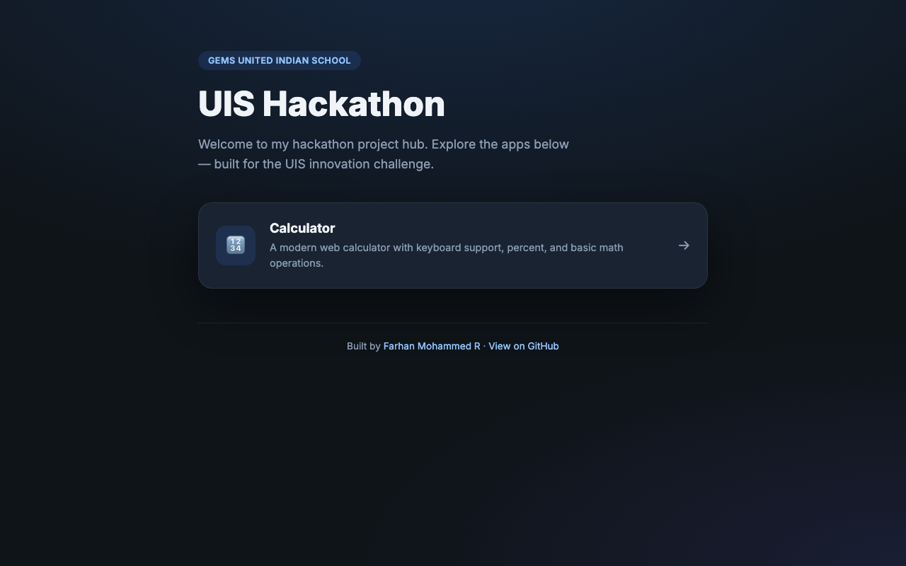
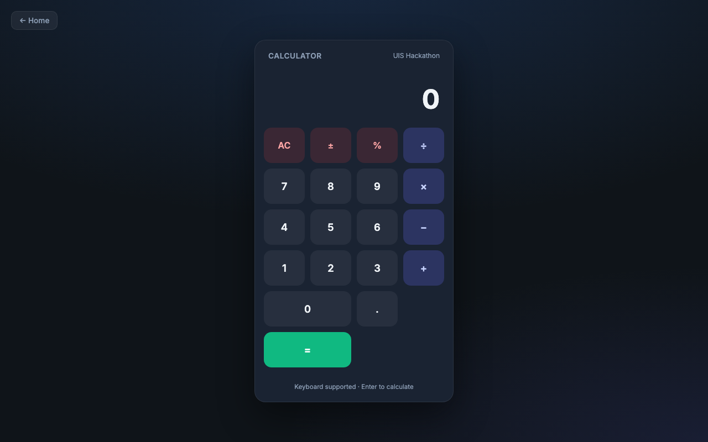

# UIS Hackathon

A collection of web apps built for the **GEMS United Indian School (UIS) Hackathon** — starting with a modern home page and a fully functional calculator.

**Author:** [Farhan Mohammed R](https://github.com/FARHANMOHAMMED-R)  
**Repository:** [github.com/FARHANMOHAMMED-R/UIS-Hackathon](https://github.com/FARHANMOHAMMED-R/UIS-Hackathon)  
**Live demo:** Open [`index.html`](index.html) in your browser after cloning

---

## Screenshots

### Home Page
The project hub with links to all hackathon apps.



### Calculator
A dark-themed web calculator with keyboard support and basic math operations.



---

## Apps

| App | File | Description |
|-----|------|-------------|
| **Home** | [`index.html`](index.html) | Welcome page and app launcher |
| **Calculator** | [`calculator.html`](calculator.html) | Add, subtract, multiply, divide with keyboard support |

---

## Features

### Home Page
- Clean, modern dark UI
- App cards with links to each project
- Mobile-friendly layout

### Calculator
- Basic operations: `+`, `−`, `×`, `÷`
- **AC** (clear), **±** (toggle sign), **%** (percent)
- Full **keyboard support** (number keys, Enter, Escape, Backspace)
- Divide-by-zero error handling
- **← Home** link to return to the main page

---

## Getting Started

No install or build step required — pure HTML, CSS, and JavaScript.

```bash
git clone git@github.com:FARHANMOHAMMED-R/UIS-Hackathon.git
cd UIS-Hackathon
open index.html
```

Or on Windows:
```bash
start index.html
```

### Optional: run with a local server

```bash
# Python
python3 -m http.server 8000

# Node.js
npx serve .
```

Then visit `http://localhost:8000`

---

## Project Structure

```
UIS-Hackathon/
├── index.html          # Home page
├── calculator.html     # Calculator app
├── screenshots/
│   ├── home.png        # Home page screenshot
│   └── calculator.png  # Calculator screenshot
└── README.md
```

---

## Tech Stack

| Layer | Technology |
|-------|------------|
| Markup | HTML5 |
| Styling | CSS3 (custom properties, Grid, Flexbox) |
| Logic | Vanilla JavaScript |
| Fonts | Google Fonts (Inter) |

---

## Hackathon Context

This project was created for the **UIS Hackathon** — a school innovation challenge at GEMS United Indian School focused on building practical, useful web tools.

**Goal:** Create simple, polished apps that solve everyday problems — starting with a calculator accessible from a central home page.

---

## Roadmap

- [x] Home page with app links
- [x] Web calculator with keyboard support
- [ ] Smart Marks Manager (teacher dashboard)
- [ ] More hackathon apps linked from the home page

---

## License

Open source — free for educational and hackathon use.

---

## Contact

**Farhan Mohammed R**  
GitHub: [@FARHANMOHAMMED-R](https://github.com/FARHANMOHAMMED-R)
